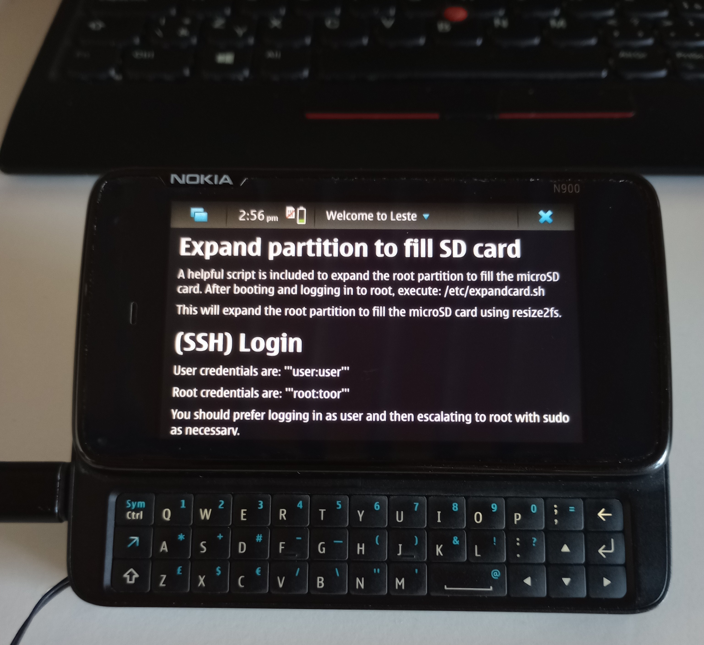

# Leste



- [Leste](#leste)
  - [Links](#links)
  - [Installation of Maemo Leste on Nokia N900](#installation-of-maemo-leste-on-nokia-n900)
    - [Existing Fremantle](#existing-fremantle)
    - [Increase filesystem size](#increase-filesystem-size)
    - [More RAM](#more-ram)
    - [(SSH) Login](#ssh-login)
  - [Resources](#resources)

## Links

1. [Maemo Leste](https://maemo-leste.github.io/)
3. [Maemo Leste N900 images](https://maedevu.maemo.org/images/n900/)

## Installation of Maemo Leste on Nokia N900
Done according to [Maemo Leste for Nokia N900](https://leste.maemo.org/Nokia_N900).

### Existing Fremantle
If you have a functional Fremantle installation, you can follow these steps instead:

1. Install "U-Boot with kernel 2.6.28-omap1"

2. Install "Linux kernel for power user (boot image for U-Boot)". This is optional, but recommended.

3. Add Maemo Leste menu item (run as root):
```sh
cat > /etc/bootmenu.d/30-maemo-leste.item << "EOF" &&
ITEM_NAME="Maemo Leste"
ITEM_KERNEL="uImage"
ITEM_DEVICE="${EXT_CARD}p1"
ITEM_FSTYPE="ext2"
EOF
u-boot-update-bootmenu
```
4. Reboot the device with the keyboard slide open (U-boot will boot the default option if the keyboard slide is closed)

### Increase filesystem size
Run the following script: `/etc/expandcard.sh`

```sh
sudo /etc/expandcard.sh
```

> [!note]
> This will expand the root partition to fill the microSD card using **resize2fs**.

### More RAM
You can install `zram-tools` from the repo, and edit `/etc/default/zramswap` as necessary. It's probably convenient to set allocation to 1024. hildon-base (and it's hildon-env-setup initscript) are aware if zramswap in installed and will activate zram.

### (SSH) Login
User credentials are: **user:user**

Root credentials are: **root:toor**

## Resources
- [Maemo Leste for Nokia N900](https://leste.maemo.org/Nokia_N900)
- [Maemo Leste Getting Started](https://leste.maemo.org/Getting_Started)