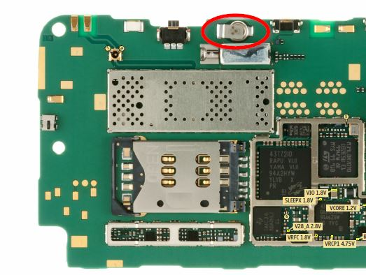

# Nokia N900 Resources
Various links, notes and files for Nokia N900.

- [Nokia N900 Resources](#nokia-n900-resources)
  - [Nokia N900 Notes](#nokia-n900-notes)
    - [My notes for Maemo](#my-notes-for-maemo)
    - [My notes for postmarketOS](#my-notes-for-postmarketos)
    - [Other notes](#other-notes)
  - [OS](#os)
    - [Postmarket OS (pmOS)](#postmarket-os-pmos)
    - [Maemo Leste](#maemo-leste)
    - [Maemo Fremantle](#maemo-fremantle)
    - [NITDroid](#nitdroid)
    - [Debian](#debian)
    - [Other OS](#other-os)
  - [FIX Nokia](#fix-nokia)
  - [HW](#hw)
    - [Neo900](#neo900)
    - [Serial port](#serial-port)
    - [RTC backup baterry](#rtc-backup-baterry)

## Nokia N900 Notes

### My notes for Maemo 
1. [SSH to Maemo](./doc/Nokia%20N900%20-%20SSH.md)

### My notes for postmarketOS

1. [SSH to postmarketOS](./doc/pmos_SSH.md)
2. [wordgrinder installation on postmarketOS](./doc/pmos_wordgrinder.md)
3. [Terminal Clock for PMOS (compile native)](./doc/pmos_tty-clock_native.md)
4. [pmOS APK Packaging for app binaries](./doc/pmos_apk_packaging.md)
5. [Podcasts](./doc/pmos_podcasts.md)
6. [(un)Successful overclocking of the SoC on pmOS](./doc/pmos_overclocking.md)

### Other notes

1. [pmOS for Nokia N900](https://wiki.postmarketos.org/wiki/Nokia_N900_(nokia-n900))
2. [NikkSaan's Nokia N900 Dev Journal](https://gist.github.com/NikkSaan/b8dec1ddb368e0d8ea7b413d8533e2ef)
3. [NikkSaan's n900-battery-monitor script](https://gist.github.com/NikkSaan/800c17d87dddfaa9edf5274130717d73)
4. [Ollieparanoid's Dogfooding:N900](https://wiki.postmarketos.org/wiki/User:Ollieparanoid/Dogfooding:N900)
5. [saku-bruh's Custom i3wm Config](https://github.com/saku-bruh/i3-n900)
6. [Full size USB mod on N900](https://simpledevices.blogspot.com/2015/04/a-few-modifications-of-nokia-n900.html)
9. [Maemo Leste via proot for ARM64 Android](https://github.com/diejuse/proot_MaemoLeste_on_Android)

## OS

### Postmarket OS (pmOS)

[Postmarket OS](./pmOS_files/Postmarket%20OS.md)

### Maemo Leste
[Leste](./maemo_leste_files/Leste.md)

### Maemo Fremantle

[Maemo 5](./maemoOS_files/Maemo%205.md)

1. [maemo viniciuspaes](https://maemo.viniciuspaes.com/)
2. [The Perfect Setup](https://wiki.maemo.org/N900_The_Perfect_Setup)
3. [MAEMOs.ru](http://maemos.ru/faq/)
4. [Accessing sensors and actuators](https://mlab.taik.fi/paja/?p=1263)
5. [Dev reflash instructions's svcavallar](https://gist.github.com/svcavallar/8e7809de10eded30b2d510fcc9685963)
6. [Latest Official Maemo Development Environment Downloads](http://web.archive.org/web/20131117084237/http://skeiron.org/tablets-dev/maemo_dev_env_downloads/)
7. [How to Reset a Nokia N900](https://www.wikihow.tech/Reset-a-Nokia-N900)
8. [Repair/Setup a bricked Nokia N900](https://harald.ist.org/howto/n900/repair_bricked_phone.html)
9. [Overclocking](https://wiki.maemo.org/Overclocking)
10. [Archive.org files](https://archive.org/details/nokia_N900)

### NITDroid

1. [Nokia N900 NITDroid multiboot with Android 2.3 Gingerbread (depricated, just for general information)](https://github.com/mattiacantalu/Nokia_N900_NITDroid)
2. [NITDroid on dedicated disk part](https://talk.maemo.org/showthread.php?t=101345)
3. [Install manual's maxed-nokia-n900](http://maxed-nokia-n900.blogspot.com/)
4. [Archive.org files](https://archive.org/details/NokiaN900NITdroid)
5. [Triple-boot - Maemo 5 + Maemo 7 Leste + Android 2.3.4](https://talk.maemo.org/showthread.php?t=101338)

### Debian
1. [Debian on Nokia N900](https://wiki.debian.org/DebianOnN900)
2. [Debian on N900](https://n900.elektranox.org/index.html)
3. [Debian900](https://github.com/dderby/debian900)
4. [Easy Debian](https://wiki.maemo.org/Easy_Debian)
5. [Qole's Debian](https://qole.org/files/debian900/)

### Other OS

1. [Kali Linux Rolling Edition (depricated)](https://talk.maemo.org/showthread.php?t=96573)
2. [Arch Linux ARM (depricated)](https://talk.maemo.org/showthread.php?t=81892)

## FIX Nokia

1. [RescueOS](https://github.com/quitesimpleorg/N900_RescueOS) [(description)](https://quitesimple.org/page/N900rescueOS)
- https://talk.maemo.org/showthread.php?t=100920
- https://github.com/mattiacantalu/Nokia-N900-RX-51-20.2010
- http://maemo.org/downloads/product/Maemo5/backupmenu/
- https://www.lemmymorgan.com/how-to-manually-flash-nokia-n900-with-usb-cable/
- https://kicherer.org/joomla/index.php/en/blog/32-recovering-a-non-booting-nokia-n900-with-maemo-from-a-sd-card

- https://wiki.maemo.org/Updating_the_firmware
- https://maemo.viniciuspaes.com/flasher/#flasher-3.5

## HW

### Neo900

1. [maemo.cloud-7.de](http://maemo.cloud-7.de/)
2. [maemo.cloud-7.de/Neo900](http://maemo.cloud-7.de/Neo900/)

### Serial port
- [elektranox.org/serial-adapter](https://n900.elektranox.org/serial-adapter.html)

### RTC backup baterry
- [Nokia N900 Back-Up Battery Replacement?](https://talk.maemo.org/showthread.php?t=92199)
- [losing time/date on battery swap?](https://talk.maemo.org/showthread.php?t=90864)

