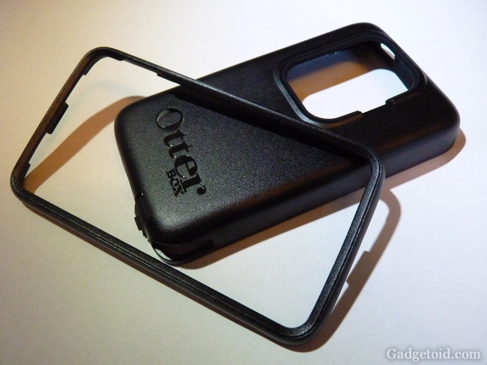

# Nokia N900 Resources
Various links, notes and files for Nokia N900.

- [Nokia N900 Resources](#nokia-n900-resources)
  - [Nokia N900 Notes](#nokia-n900-notes)
    - [My notes for Maemo](#my-notes-for-maemo)
    - [My notes for postmarketOS](#my-notes-for-postmarketos)
    - [Other notes](#other-notes)
  - [OS](#os)
    - [Postmarket OS (pmOS)](#postmarket-os-pmos)
    - [Maemo's](#maemos)
      - [Maemo Fremantle](#maemo-fremantle)
      - [Maemo Leste](#maemo-leste)
    - [NITDroid](#nitdroid)
    - [Debian](#debian)
    - [Other OS](#other-os)
  - [FIX Nokia](#fix-nokia)
    - [Tools](#tools)
  - [HW](#hw)
    - [USB host mode:](#usb-host-mode)
    - [More USB](#more-usb)
    - [Neo900](#neo900)
    - [Game pad](#game-pad)
    - [Game Gripper](#game-gripper)
    - [OtterBox](#otterbox)
    - [Serial port](#serial-port)
    - [RTC backup baterry](#rtc-backup-baterry)

## Nokia N900 Notes

### My notes for Maemo 
1. [SSH to Maemo](./doc/Nokia%20N900%20-%20SSH.md)
2. [SMB on Maemo](./doc/maemo_smb.md)
3. [(un)successful Git on Maemo](./doc/maemo_git.md)
4. [(un)successful compilation of Python 3.11](https://github.com/elPytel/Python_3.11_on_N900)
5. [(TO-DO) How to import and export contacts on Maemo](./doc/meamo_contacts.md)

### My notes for postmarketOS

1. [SSH to postmarketOS](./doc/pmos_SSH.md)
2. [wordgrinder installation on postmarketOS](./doc/pmos_wordgrinder.md)
3. [Terminal Clock for PMOS (compile native)](./doc/pmos_tty-clock_native.md)
4. [pmOS APK Packaging for app binaries](./doc/pmos_apk_packaging.md)
5. [Podcasts](./doc/pmos_podcasts.md)
6. [(un)Successful overclocking of the SoC on pmOS](./doc/pmos_overclocking.md)

### Other notes

1. [pmOS for Nokia N900](https://wiki.postmarketos.org/wiki/Nokia_N900_(nokia-n900))
2. [NikkSaan's Nokia N900 Dev Journal](https://gist.github.com/NikkSaan/b8dec1ddb368e0d8ea7b413d8533e2ef)
3. [NikkSaan's n900-battery-monitor script](https://gist.github.com/NikkSaan/800c17d87dddfaa9edf5274130717d73)
4. [Ollieparanoid's Dogfooding:N900](https://wiki.postmarketos.org/wiki/User:Ollieparanoid/Dogfooding:N900)
5. [saku-bruh's Custom i3wm Config](https://github.com/saku-bruh/i3-n900)
6. [Maemo Leste via proot for ARM64 Android](https://github.com/diejuse/proot_MaemoLeste_on_Android)
7.  [Nokia N900 Versus Motorola Droid](https://gadgetoid.com/2009/12/21/nokia-n900-versus-motorola-droidmilestone/)
8.  [pittnerovi.com](https://www.pittnerovi.com/jiri/hobby/electronics/n900/)

## OS

### Postmarket OS (pmOS)

[Postmarket OS](./pmOS_files/Postmarket%20OS.md)

### Maemo's
- [YouTube: All About Maemo](https://www.youtube.com/@allaboutmaemo/videos)
- [ter Smitten's web](https://blog.tersmitten.nl/tag/n900)
- [Tracy and Matt](https://www.tracyandmatt.co.uk):
  - [How to add internet radio stations to the Nokia N9](https://www.tracyandmatt.co.uk/how-to-add-internet-radio-stations-to-the-nokia-n9/)
  - [How to install MSN, Yahoo Messenger, AIM, ICQ, etc. on the Nokia N9](https://www.tracyandmatt.co.uk/how-to-install-msn-yahoo-messenger-aim-icq-etc-on/)
- [MyNokiaBlog](http://mynokiablog.com/):
  - [Apps, Apps and Some More Apps for Your Nokia N900 (Maemo 5)](http://mynokiablog.com/2010/05/13/apps-apps-and-some-more-apps-for-your-nokia-n900-maemo-5/)
  - [Facebook Chat for N900's Inbuilt Conversations App](http://mynokiablog.com/2010/02/06/facebook-chat-for-n900s-inbuilt-conversations-app/)
  - [Yappari A WhatsApp Client for the N900](http://mynokiablog.com/2012/06/04/yappari-a-whatsapp-client-for-the-n900/)
- [Techie Corner](https://www.techiecorner.com/)
  - [How to enchance and increase battery life for N900](https://www.techiecorner.com/1633/how-to-enchance-and-increase-battery-life-for-n900/)
  - [How to import contacts from SIM card to Nokia N900](https://www.techiecorner.com/1591/how-to-import-contacts-from-sim-card-to-nokia-n900/)

#### Maemo Fremantle

[Maemo 5](./maemoOS_files/Maemo%205.md)

1. [maemo viniciuspaes](https://maemo.viniciuspaes.com/)
2. [The Perfect Setup](https://wiki.maemo.org/N900_The_Perfect_Setup)
3. [MAEMOs.ru](http://maemos.ru/faq/)
4. [Accessing sensors and actuators](https://mlab.taik.fi/paja/?p=1263)
5. [Dev reflash instructions's svcavallar](https://gist.github.com/svcavallar/8e7809de10eded30b2d510fcc9685963)
6. [Latest Official Maemo Development Environment Downloads](http://web.archive.org/web/20131117084237/http://skeiron.org/tablets-dev/maemo_dev_env_downloads/)
7. [How to Reset a Nokia N900](https://www.wikihow.tech/Reset-a-Nokia-N900)
8. [Repair/Setup a bricked Nokia N900](https://harald.ist.org/howto/n900/repair_bricked_phone.html)
9. [Overclocking](https://wiki.maemo.org/Overclocking)
10. [Archive.org files](https://archive.org/details/nokia_N900)
11. [Phone control](https://wiki.maemo.org/Phone_control)
12. [SMSCON](https://wiki.maemo.org/SMSCON)

#### Maemo Leste
[Leste](./maemo_leste_files/Leste.md)

### NITDroid

1. [Nokia N900 NITDroid multiboot with Android 2.3 Gingerbread (depricated, just for general information)](https://github.com/mattiacantalu/Nokia_N900_NITDroid)
2. [NITDroid on dedicated disk part](https://talk.maemo.org/showthread.php?t=101345)
3. [Install manual's maxed-nokia-n900](http://maxed-nokia-n900.blogspot.com/)
4. [Triple-boot - Maemo 5 + Maemo 7 Leste + Android 2.3.4](https://talk.maemo.org/showthread.php?t=101338)

### Debian
1. [Debian on Nokia N900](https://wiki.debian.org/DebianOnN900)
2. [Debian on N900](https://n900.elektranox.org/index.html)
3. [Debian900](https://github.com/dderby/debian900)
4. [Easy Debian](https://wiki.maemo.org/Easy_Debian)
5. [Qole's Debian](https://qole.org/files/debian900/)

### Other OS

1. [Kali Linux Rolling Edition (depricated)](https://talk.maemo.org/showthread.php?t=96573)
2. [Arch Linux ARM (depricated)](https://talk.maemo.org/showthread.php?t=81892)
3. [QUAD BOOT: Maemo, Meego, NITDroid, and Kubuntu Mobile](https://talk.maemo.org/showthread.php?t=74956)

## FIX Nokia

1. [RescueOS](https://github.com/quitesimpleorg/N900_RescueOS) [(description)](https://quitesimple.org/page/N900rescueOS)
2. [Reviving an old N900 without lock code](https://blog.tldnr.org/2015/01/10/reviving-an-old-n900-without-lock-code/)
- [What is your easiest way to reinstall N900?](https://talk.maemo.org/showthread.php?t=100920)
- [Nokia N900 last firmware](https://github.com/mattiacantalu/Nokia-N900-RX-51-20.2010)
- [Maemo: Backup Menu](http://maemo.org/downloads/product/Maemo5/backupmenu/)
- [How to manually flash Nokia N900 with USB cable](https://www.lemmymorgan.com/how-to-manually-flash-nokia-n900-with-usb-cable/)
- [Recovering a non-booting Nokia N900 with Maemo from a SD card](https://kicherer.org/joomla/index.php/en/blog/32-recovering-a-non-booting-nokia-n900-with-maemo-from-a-sd-card)

- [Maemo: Updating the firmware](https://wiki.maemo.org/Updating_the_firmware)

### Tools
Maemo Flasher 3.5:

| File | OS | Size |
| --- | --- | --- |
| [maemo_flasher-3.5_2.5.2.2.exe](./tools/flasher-3.5/maemo_flasher-3.5_2.5.2.2.exe) | Windows | 3.5 MB |
| [maemo_flasher-3.5_2.5.2.2_i386.deb](./tools/flasher-3.5/maemo_flasher-3.5_2.5.2.2_i386.deb) | Linux (Debian i386) | 58 KB |
| [maemo_flasher-3.5_2.5.2.2.tar.gz](./tools/flasher-3.5/maemo_flasher-3.5_2.5.2.2.tar.gz) | Linux (tarball) | 48 KB |
| [maemo_flasher-3.5_2.5.2.2_i386.dmg](./tools/flasher-3.5/maemo_flasher-3.5_2.5.2.2_i386.dmg) | Mac OS X (Intel) | 423 KB |
| [maemo_flasher-3.5_2.5.2.2_ppc.dmg](./tools/flasher-3.5/maemo_flasher-3.5_2.5.2.2_ppc.dmg) | Mac OS X (PPC) | 243 KB |
| [LICENSE](./tools/flasher-3.5/LICENSE) | - | 14 KB |
| [Readme_Maemo_Flasher-3.5.txt](./tools/flasher-3.5/Readme_Maemo_Flasher-3.5.txt) | - | 7 KB |

- [Maemo Flasher 3.5 - Download](https://maemo.viniciuspaes.com/flasher/)

## HW

- [CPU](https://wiki.maemo.org/N900_CPU)

Bleuooth:
- [Typing with Bluetooth Keyboard](http://mynokiablog.com/2010/03/05/video-typing-with-bluetooth-keyboard-nokia-su-w8-on-the-nokia-n900-finally-replace-your-netbook/)

### USB host mode:
- [USB networking](https://wiki.maemo.org/N900_USB_networking)
- [YouTube: Nokia N900 + Ethernet (via USB-RJ45 adapter)](https://www.youtube.com/watch?v=3IyeSNGCWTA)
- [YouTube: Nokia N900 + USB Flash Drive: copy 1.46 GB movie](https://www.youtube.com/watch?v=6ED92orZLMM)
- [YouTube: Nokia N900 + USB Card Reader](https://www.youtube.com/watch?v=0YPk4Y0ZPQY)
- [YouTube: Nokia N900 + 500GB USB HDD (via active USB hub) - hostmode](https://www.youtube.com/watch?v=1Qfx_jaQ9jo)

### More USB
- [Full size USB mod on N900](https://simpledevices.blogspot.com/2015/04/a-few-modifications-of-nokia-n900.html)

### Neo900

1. [maemo.cloud-7.de](http://maemo.cloud-7.de/)
2. [maemo.cloud-7.de/Neo900](http://maemo.cloud-7.de/Neo900/)

### Game pad
- [Hackaday: Nokia N900 Control Pad](https://hackaday.com/2011/12/12/nokia-n900-control-pad-is-perfect-for-gaming-on-the-go/)

### Game Gripper

- [Thingiverse: Nokia N900 Slide-On Keyboard Gamepad for Emulators](https://www.thingiverse.com/thing:113285)
- [Gadgetoid: N900 Game Gripper Review](https://gadgetoid.com/2010/08/18/n900-game-gripper-review/)
- [YouTube: Game Gripper - Nokia N900 - Review](https://www.youtube.com/watch?v=utOYw_8Y8Iw)

### OtterBox

- [Gadgetoid: OtterBox Commuter Plastic/Rubber Case for Nokia N900 Review](https://gadgetoid.com/2010/05/20/otterbox-commuter-plasticrubber-case-for-nokia-n900-review/)

### Serial port
- [elektranox.org/serial-adapter](https://n900.elektranox.org/serial-adapter.html)

### RTC backup baterry
- [Nokia N900 Back-Up Battery Replacement?](https://talk.maemo.org/showthread.php?t=92199)
- [losing time/date on battery swap?](https://talk.maemo.org/showthread.php?t=90864)

