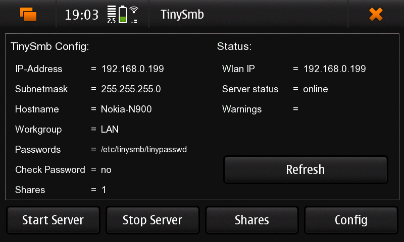
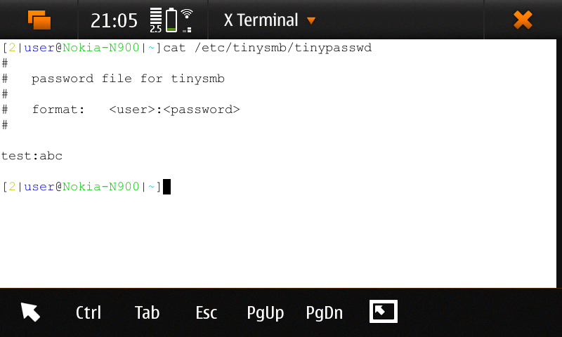

# SMB

- [SMB](#smb)
  - [tinySMB](#tinysmb)
    - [Install steps:](#install-steps)
    - [Default settings:](#default-settings)
    - [Command Line Installation](#command-line-installation)
    - [Connection to the share](#connection-to-the-share)
    - [Connecting to the share from GUI:](#connecting-to-the-share-from-gui)
  - [Samba 3.5.6](#samba-356)
  - [References](#references)

## tinySMB

Files:
- [tinysmb.deb](../maemoOS_files/deb/tinysmb/tinysmb_1.0.0_armel.deb)
- [tinysmbgui.deb](../maemoOS_files/deb/tinysmb/tinysmbgui_1.0.0_armel.deb)

### Install steps:

1. install `tinysmb.deb`
2. install `tinysmbgui.deb`
3. After installing you have a new Icon in the Application Menu: **TinySmb**.
4. Setup your Wlan IP with **Config** button.
5. Add your Shares with the **Shares** button.
6. Now you can start the Server.
7. Access the Share from your PC with `\\192.168.178.37\`
replace **192.168.178.37** with your Wlan IP of your N900

In your PCs browser type in `\\192.168.178.37\` (use here the IP of your N900). And it should show you the share name.


### Default settings:
- Username: `test`
- Password: `abc`
- Workgroup: `LAN`
- Port: `139`





> [!note]
> If you have problem with IP address, you can use `ifconfig` command to find your IP address:
```bash
/sbin/ifconfig wlan0 | grep inet
```

Ports used by tinySMB:
```bash
[1|user@Nokia-N900|~]netstat -tlnp                                             
netstat: showing only processes with your user ID
Active Internet connections (only servers)
Proto Recv-Q Send-Q Local Address           Foreign Address         State       PID/Program name    
tcp        0      0 192.168.0.199:139       0.0.0.0:*               LISTEN      -
tcp        0      0 0.0.0.0:39501           0.0.0.0:*               LISTEN      6726/TinySmbGui
tcp        0      0 127.0.0.1:53            0.0.0.0:*               LISTEN      -
tcp        0      0 0.0.0.0:22              0.0.0.0:*               LISTEN      -
netstat: /proc/net/tcp6: No such file or directory
```

### Command Line Installation
Or you can install the app with command line:
```bash
1. dpkg -i tinysmb.deb
2. dpkg -i tinysmbgui.deb
3. edit files in /etc/tinysmb
   there are two files...
```


### Connection to the share
Connection to the share from the PC:

> [!warning]
> If you get an error like this:
```bash
smbclient -L 192.168.0.199 -p 139
Protocol negotiation to server 192.168.0.199 (for a protocol between SMB2_02 and SMB3) failed: NT_STATUS_CONNECTION_DISCONNECTED
```
> [!note]
> The `-m NT1` option is used to specify the maximum protocol version to use, which is necessary for compatibility with older Samba versions.

```bash
smbclient -L 192.168.0.199 -p 139 -m NT1
lp_load_ex: Max protocol NT1 is less than min protocol SMB2_02.
Protocol negotiation to server 192.168.0.199 (for a protocol between SMB2_02 and NT1) failed: NT_STATUS_INVALID_PARAMETER_MIX
```

> [!tip]
> Check your `/etc/samba/smb.conf` file for the following settings and add `client min protocol = NT1` if it is not present:
```ini
#======================= Global Settings =======================
[global]
## Browsing/Identification ###

# Change this to the workgroup/NT-domain name your Samba server will part of
   workgroup = WORKGROUP
   client min protocol = NT1
```

Working example in the terminal:
```bash
smbclient //192.168.0.199/N900 -p 139 -m NT1 -U test%abc --option='client use spnego=no' --option='client ntlmv2 auth=no'
```

- `-p` - port number
- `-m NT1` - maximum protocol version to use
- `-U test%abc` - username and password (in this case, the username is `test` and the password is `abc`)
- `--option='client use spnego=no'` - disables SPNEGO authentication
- `--option='client ntlmv2 auth=no'` - disables NTLMv2 authentication

### Connecting to the share from GUI:
1. Open the file manager (File Manager or similar).
2. In the address bar, type the following:
```
smb://test@192.168.0.199:139/N900
```


## Samba 3.5.6
If you know something about the linux console and samba you can try Samba 3.5.6 from Extra Devel.

Unfortunately, the Samba package from Nathan has missing dependencies and there are no news since february 2010.
```bash
apt-get install smb
```

Where to put the smb.conf file (a very simple conf file can also found in that directory):
```bash
/etc/samba
```

Start samba daemons (as root):
```bash
smbd
nmbd
```

## References
- [Maemo: SMB](https://talk.maemo.org/showthread.php?p=786325#post786325)
- [AzSmb](http://members.inode.at/anton.zechner/az/AzSmb.en.htm)