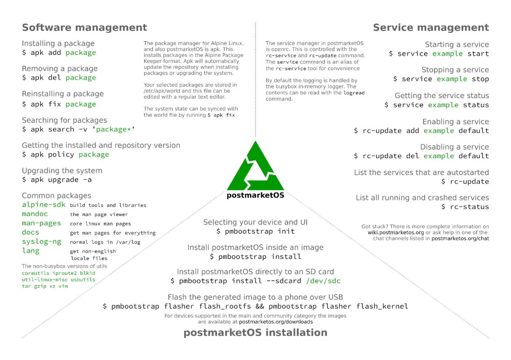

# Postmarket OS

- [Postmarket OS](#postmarket-os)
  - [Files for postmarketOS](#files-for-postmarketos)
    - [Configs](#configs)
    - [Scripts](#scripts)
  - [OS imgs](#os-imgs)
    - [installation](#installation)
  - [login](#login)
  - [Applications](#applications)
    - [installation](#installation-1)
    - [Bash](#bash)
    - [SSH](#ssh)
    - [More apps](#more-apps)
  - [Overclocking](#overclocking)
  - [i3wm](#i3wm)
    - [Shortcuts](#shortcuts)
        - [default mode](#default-mode)
        - [command mode](#command-mode)
        - [workspace mode](#workspace-mode)
        - [Other](#other)
          - [Display brightness](#display-brightness)

## Files for postmarketOS

Useful files for postmarketOS which are oriented to Nokia N900.



### Configs

- `i3` - configuration files for [`i3`](https://wiki.archlinux.org/title/i3) (modified version from [saku-bruh](https://github.com/saku-bruh/i3-n900));
- `i3blocks` - configuration files for [`i3blocks`](https://man.archlinux.org/man/i3blocks.1.en);
- `spotifyd` - configuration file for [`spotifyd`](https://github.com/Spotifyd/spotifyd) (optimized for Nokia N900).

### Scripts

- [`apk-builder.sh`](./scripts/apk-builder.sh) - script to build APK packages for postmarketOS;
- [`install.sh`](./scripts/install.sh) - script to symlink files from `scripts` directory to `/usr/local/bin/`;
- [`kb_brightness.sh`](./scripts/kb_brightness.sh) - script to control the brightness of the keypad backlight LEDs;
- [`screen_brightness.sh`](./scripts/screen_brightness.sh) - script to control the brightness of the display;
- [`n900-battery-monitor`](./scripts/n900-battery-monitor) - battery protection for the Nokia N900;
- [`screenshot.sh`](./scripts/screenshot.sh) - script to creating screenshots with [`imagemagick`](https://wiki.archlinux.org/title/ImageMagick) (depricated, it's used `scrot`.).

## OS imgs
[Postmarket OS - N900 ISO](https://images.postmarketos.org/bpo/v24.12/nokia-n900/)

> [!note]
> xfce is extremely slow

> [!note]
> i3wm is the best choice for N900 with windows manager.

### installation
https://posts.oztamir.com/running-postmarketos-on-a-nokia-n900/


Boot to Maemo. Now we need to install U-Boot. In X-Terminal:  

```sh
root
apt-get install u-boot-flasher u-boot-tools
```
It will ask for flashing kernel - agree.  

```sh
apt-get install kernel-power-bootimg
```
It may ask for flashing kernel - DISagree.  

Now, we create item file for U-Boot. Let's create file:  
```sh
vim /etc/bootmenu.d/10-pmos.item
```

Now type all lines very carefully:  
```txt
ITEM_NAME="postmarketOS"
ITEM_SCRIPT="boot.scr"
ITEM_DEVICE="${EXT_CARD}p1"
ITEM_FSTYPE="ext2"
```
Save it.  

```sh
u-boot-update-bootmenu
```

https://talk.maemo.org/showthread.php?t=101301

## login
Username and password:

**user**

**147147**

## Applications

### installation
```sh
apk add bash curl git make
```

### Bash
```sh
chsh -s /bin/bash user
```

### SSH
[SSH to postmarketOS](../doc/pmos_SSH.md)

### More apps
mupdf-x11 - PDF viewer
spotifyd - Spotify client
```sh
sudo apk add spotifyd
```


mplayer - video player

```sh	
nokia-n900:/$ mplayer
MPlayer UNKNOWN-14.2.0 (C) 2000-2023 MPlayer Team
226 audio & 469 video codecs
Usage:   mplayer [options] [url|path/]filename

Basic options: (complete list in the man page)
 -vo <drv>        select video output driver ('-vo help' for a list)
 -ao <drv>        select audio output driver ('-ao help' for a list)
 vcd://<trackno>  play (S)VCD (Super Video CD) track (raw device, no mount)
 dvd://<titleno>  play DVD title from device instead of plain file
 -alang/-slang    select DVD audio/subtitle language (by 2-char country code)
 -ss <position>   seek to given (seconds or hh:mm:ss) position
 -nosound         do not play sound
 -fs              fullscreen playback (or -vm, -zoom, details in the man page)
 -x <x> -y <y>    set display resolution (for use with -vm or -zoom)
 -sub <file>      specify subtitle file to use (also see -subfps, -subdelay)
 -playlist <file> specify playlist file
 -vid x -aid y    select video (x) and audio (y) stream to play
 -fps x -srate y  change video (x fps) and audio (y Hz) rate
 -pp <quality>    enable postprocessing filter (details in the man page)
 -framedrop       enable frame dropping (for slow machines)

Basic keys: (complete list in the man page, also check input.conf)
 <-  or  ->       seek backward/forward 10 seconds
 down or up       seek backward/forward  1 minute
 pgdown or pgup   seek backward/forward 10 minutes
 < or >           step backward/forward in playlist
 p or SPACE       pause movie (press any key to continue)
 q or ESC         stop playing and quit program
 + or -           adjust audio delay by +/- 0.1 second
 o                cycle OSD mode:  none / seekbar / seekbar + timer
 * or /           increase or decrease PCM volume
 x or z           adjust subtitle delay by +/- 0.1 second
 r or t           adjust subtitle position up/down, also see -vf expand

 * * * SEE THE MAN PAGE FOR DETAILS, FURTHER (ADVANCED) OPTIONS AND KEYS * * *
```

pure-maps - maps application
https://wiki.postmarketos.org/wiki/Pure_Maps


## Overclocking


> [!warning] 
> Not stable.

## i3wm

### Shortcuts
##### default mode

- shift + space: switch to "command mode"
##### command mode

- t: open terminal
- k: kill current program
- w: workspace mode
- r: restart i3wm (use after modifying the config)
- q: go back to "default mode"

##### workspace mode

- a/s/d/f/g: switch to workspace 1/2/3/4/5
- q: go back to "command mode"

##### Other

###### Display brightness

With the current configuration, you can adjust the display brightness using the volume keys while holding the Shift key.